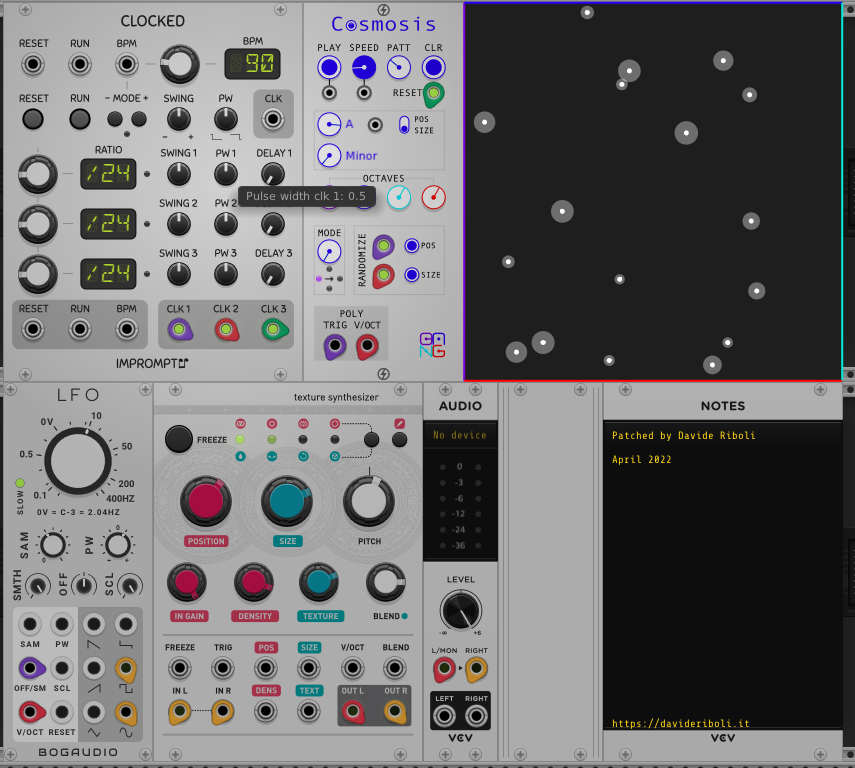

"Cosmosis" è un modulo VCV di [Jeremy Muller](https://github.com/jeremymuller/Sha-Bang-Modules) che permette di ottenere partiture a partire dalla posizione delle stelle di una determinata costellazione.

Per cominciare a giocarci un po' ho creato questa patch generativa a partire dalle stelle della Costellazione del Drago sebbene, come sanno tutti, _draco dormiens nunquam titillandus est_.

