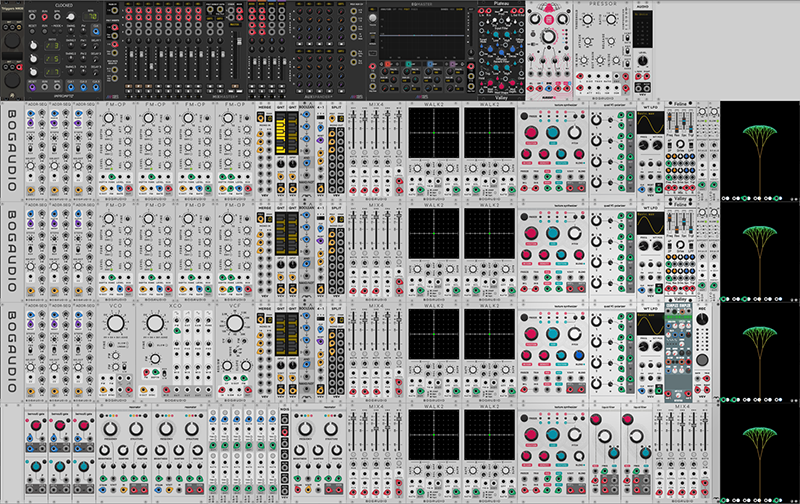

# Info

- Titolo patch originale = Incanta Generative Ambient
- Link patch originale = [https://patchstorage.com/incanta-generative-ambient/](https://patchstorage.com/incanta-generative-ambient/)
- Autore patch originale = [Massi](https://patchstorage.com/author/massi/)
- Licenza = Creative Commons Attribution 4.0

## Elenco Plugin

- "AlrightDevices" - "Chronoblob2"
- "AS" - "TriggersMKIII"
- "AudibleInstruments" - "Blinds"
- "AudibleInstruments" - "Branches"
- "AudibleInstruments" - "Clouds"
- "AudibleInstruments" - "Rings"
- "AudibleInstruments" - "Ripples"
- "Bogaudio" - "Bogaudio-AddrSeq"
- "Bogaudio" - "Bogaudio-Blank6"
- "Bogaudio" - "Bogaudio-FMOp"
- "Bogaudio" - "Bogaudio-LLFO"
- "Bogaudio" - "Bogaudio-Mix4"
- "Bogaudio" - "Bogaudio-Pressor"
- "Bogaudio" - "Bogaudio-SampleHold"
- "Bogaudio" - "Bogaudio-VCF"
- "Bogaudio" - "Bogaudio-VCO"
- "Bogaudio" - "Bogaudio-Walk2"
- "Bogaudio" - "Bogaudio-XCO"
- "Core" - "AudioInterface2"
- "Core" - "Blank"
- "CountModula" - "Blank2HP"
- "CountModula" - "BooleanAND"
- "Fundamental" - "LFO2"
- "Fundamental" - "Merge"
- "Fundamental" - "Noise"
- "Fundamental" - "Quantizer"
- "Fundamental" - "SequentialSwitch2"
- "Fundamental" - "Split"
- "ImpromptuModular" - "Clocked"
- "JW-Modules" - "Tree"
- "MindMeldModular" - "AuxExpanderJr"
- "MindMeldModular" - "EqMaster"
- "MindMeldModular" - "MixMasterJr"
- "NYSTHI" - "complexSimpler"
- "Valley" - "Feline"
- "Valley" - "Plateau"
- "VCV-Recorder" - "Recorder"